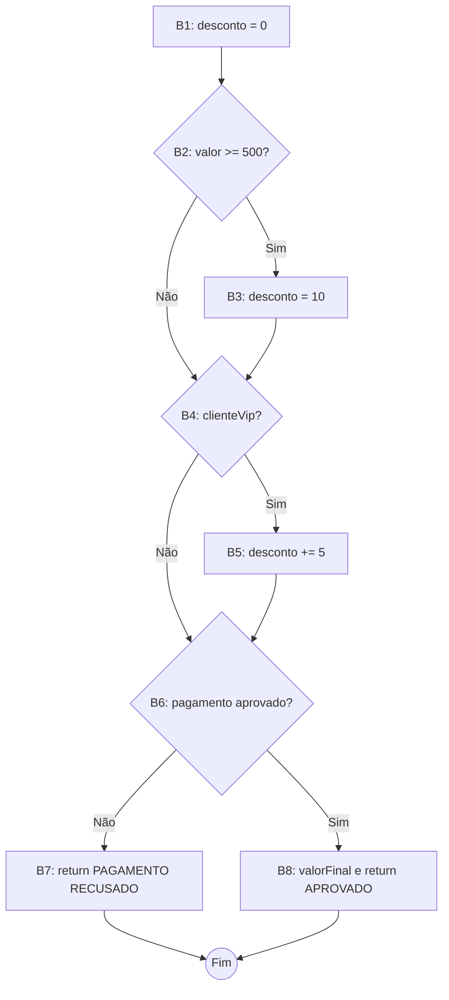

# Respostas — Grafos de Fluxo de Controle

**Disciplina:** Projeto, Implementação e Teste de Software  
**Integrante:** Enzo Ayres Bettini — RA 241955272

---

## Exercício 1 — Classificação de pedido

### 1. Blocos básicos

| ID | Bloco |
|----|--------|
| B1 | Entrada: `desconto = 0` |
| B2 | Decisão: `valor >= 500` |
| B3 | Atribuição: `desconto = 10` |
| B4 | Decisão: `clienteVip` |
| B5 | Atribuição: `desconto += 5` |
| B6 | Decisão: `!pagamentoAprovado` |
| B7 | Saída antecipada: `return "PAGAMENTO RECUSADO"` |
| B8 | Cálculo e saída: `valorFinal` e `return "PEDIDO APROVADO: …"` |
| B9 | Fim do método |

### 2. Decisões

1. `valor >= 500` (verdadeiro → B3; falso → segue para B4).  
2. `clienteVip` (verdadeiro → B5; falso → segue para B6).  
3. `!pagamentoAprovado` (verdadeiro → B7; falso → B8).

### 3 e 4. Grafo de fluxo de controle (com `return` antecipado)



O ramo **B6 → B7** representa o encerramento antecipado: quando o pagamento não é aprovado, **B8 não é executado**.

### 5. Contagem de nós e arestas

Modelo com **9 nós** (B1…B9, sendo B2, B4 e B6 decisões) e **11 arestas**:

B1→B2, B2→B3, B2→B4, B3→B4, B4→B5, B4→B6, B5→B6, B6→B7, B6→B8, B7→B9, B8→B9.

- **N = 9**  
- **E = 11**

### 6. Complexidade ciclomática (McCabe)

```text
V(G) = E - N + 2 = 11 - 9 + 2 = 4
```

### 7. Conferência

Três decisões → **V(G) = decisões + 1 = 3 + 1 = 4** (coincide).

### 8. Base de caminhos independentes (4 caminhos)

| Caminho | Sequência de nós | Aresta nova introduzida |
|---------|------------------|-------------------------|
| P1 | B1→B2(F)→B4(F)→B6(T)→B7→B9 | B2→B4 (falso em valor) + saída por recusa |
| P2 | B1→B2(F)→B4(F)→B6(F)→B8→B9 | B6→B8 (pagamento aprovado) |
| P3 | B1→B2(T)→B3→B4(T)→B5→B6(F)→B8→B9 | B2→B3 + B4→B5 (VIP com desconto extra) |
| P4 | B1→B2(T)→B3→B4(F)→B6(F)→B8→B9 | B4→B6 sem VIP, com desconto de 10% |

### 9 e 10. Dados de teste e resultado esperado

| Caminho | valor | clienteVip | pagamentoAprovado | Resultado esperado |
|---------|-------|------------|-------------------|---------------------|
| P1 | 100 | false | false | `"PAGAMENTO RECUSADO"` |
| P2 | 100 | false | true | `"PEDIDO APROVADO: 100.0"` (desconto 0%) |
| P3 | 600 | true | true | `"PEDIDO APROVADO: 510.0"` (desconto 15% → 600 − 90) |
| P4 | 600 | false | true | `"PEDIDO APROVADO: 540.0"` (desconto 10% → 600 − 60) |

### Questões para discussão

- **Combinações:** cada decisão tem 2 saídas → **2³ = 8** combinações lógicas de condições.  
- **Combinações vs V(G):** não são iguais. V(G) mede **caminhos estruturalmente independentes** no grafo; várias combinações convergem ao mesmo caminho (ex.: VIP ou não, com pagamento recusado, sempre terminam em B7).  
- **Efeito do `return`:** cria um nó de saída dedicado (B7) e **elimina** a aresta que levaria ao cálculo de `valorFinal` quando o pagamento falha.  
- **`valorFinal` com pagamento recusado:** **não** — o fluxo encerra em B7 antes de B8.

---

## Exercício 2 — Análise de leituras de temperatura

### 1. Blocos básicos

| ID | Bloco |
|----|--------|
| B1 | Entrada: `alertas = 0`, `i = 0` |
| B2 | Decisão do `while`: `i < temperaturas.length` |
| B3 | Decisão: `temperaturas[i] < 0` |
| B4 | `alertas += 2` |
| B5 | Decisão: `temperaturas[i] > 35` |
| B6 | `alertas += 1` |
| B7 | `i++` |
| B8 | `return alertas` |
| B9 | Fim |

### 2. Decisões

1. Condição do **`while`** (B2).  
2. Primeiro **`if`** — temperatura negativa (B3).  
3. **`else if`** — temperatura acima de 35 (B5).

### 3 e 4. Grafo de fluxo de controle

```mermaid
flowchart TD
    B1[B1: alertas=0, i=0] --> B2{B2: i < length?}
    B2 -->|Não| B8[B8: return alertas]
    B2 -->|Sim| B3{B3: temp[i] < 0?}
    B3 -->|Sim| B4[B4: alertas += 2]
    B3 -->|Não| B5{B5: temp[i] > 35?}
    B4 --> B7[B7: i++]
    B5 -->|Sim| B6[B6: alertas += 1]
    B5 -->|Não| B7
    B6 --> B7
    B7 --> B2
    B8 --> B9((Fim))
```

Elementos destacados: **entrada no laço** (B2 verdadeiro), **três classificações** (B3/B5), **incremento de i** (B7), **retorno ao while** (B7→B2), **saída** (B2 falso → B8).

### 5. Contagem

- **N = 9** (B1…B9)  
- **E = 11** (inclui a aresta de retorno B7→B2)

### 6. Complexidade ciclomática

```text
V(G) = E - N + 2 = 11 - 9 + 2 = 4
V(G) = decisões + 1 = 3 + 1 = 4
```

### 7. Base de caminhos independentes

| Caminho | Descrição |
|---------|-----------|
| P1 | B1→B2(F)→B8 — laço não executado |
| P2 | B1→B2(T)→B3(T)→B4→B7→B2(F)→B8 — uma leitura negativa |
| P3 | B1→B2(T)→B3(F)→B5(T)→B6→B7→B2(F)→B8 — uma leitura > 35 |
| P4 | B1→B2(T)→B3(F)→B5(F)→B7→B2(F)→B8 — uma leitura entre 0 e 35 |

### 8 e 9. Vetores e retorno

| Caminho | Entrada (`temperaturas`) | Retorno |
|---------|--------------------------|---------|
| P1 | `{}` (vetor vazio) | `0` |
| P2 | `{-5}` | `2` |
| P3 | `{36}` | `1` |
| P4 | `{20}` | `0` |

Exemplo com **várias iterações:** `{ -1, 20, 40 }` percorre P2, P4 e P3 em sequência → retorno **3** (2+0+1).

### 10. Por que a saída do laço aparece no CFG?

Porque **“não entrar no while”** e **“terminar as iterações”** são fluxos distintos que levam ao `return`. Sem o ramo B2(falso)→B8, o grafo não representa o método completo nem permite caminhos independentes que incluam **zero iterações**.

### Questões para discussão

- **Várias temperaturas:** um vetor longo **repete** trechos do grafo (B3→B7→B2) várias vezes; não é um único caminho estático, mas uma **composição** de passagens pelo laço.  
- **Sem acessar posição:** vetor **vazio** — B2 é falso na primeira avaliação.  
- **Fronteiras 0 e 35:** `0` cai no ramo “entre 0 e 35”; `35` também (não é `< 0` nem `> 35`) — útil para testar limites inclusivos do `else if`.  
- **`else if` como nova decisão:** só é avaliado quando B3 é falso; no CFG isso é um **segundo predicate** (B5), não um bloco linear do primeiro `if`.

---

## Checklist de entrega (critérios do enunciado)

- [x] Blocos básicos sem desvios agrupados  
- [x] Decisões com saídas verdadeira e falsa  
- [x] Ramos reconvergem ou encerram corretamente  
- [x] Laço com aresta de retorno (Exercício 2)  
- [x] `return` antecipado ligado ao fim (Exercício 1)  
- [x] Nós alcançáveis  
- [x] `V(G) = E − N + 2` = decisões + 1  
- [x] Caminhos independentes com dados de teste
